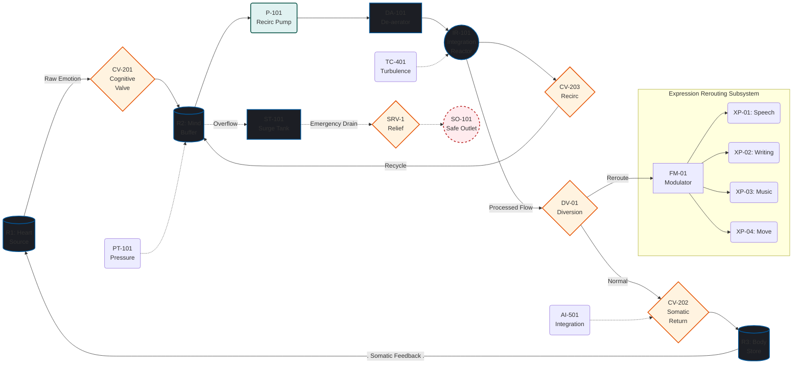

```mermaid
graph LR
    %% --- Styles ---
    classDef vessel fill:#1c1e24,stroke:#01579b,stroke-width:2px;
    classDef pump fill:#e0f2f1,stroke:#004d40,stroke-width:2px;
    classDef valve fill:#fff3e0,stroke:#e65100,stroke-width:2px,shape:diamo;
    classDef instrument fill:#f3e5f5,stroke:#4a148c,stroke-width:1px,stroke-dasharray: 5 5;
    classDef outlet fill:#ffebee,stroke:#b71c1c,stroke-width:2px,stroke-dasharray: 5 5;

    %% --- Main Reservoirs ---
    R1[(R1: Heart<br>Source)]:::vessel
    R2[(R2: Mind<br>Buffer)]:::vessel
    R3[(R3: Body<br>Store)]:::vessel

    %% --- Primary Processing Loop ---
    IR101((IR-101<br>Integration<br>Reactor)):::vessel
    P101(P-101<br>Recirc Pump):::pump
    DA101[DA-101<br>De-aerator]:::vessel
    ST101[ST-101<br>Surge Tank]:::vessel

    %% --- Valves & Regulators ---
    CV201{CV-201<br>Cognitive<br>Valve}:::valve
    CV202{CV-202<br>Somatic<br>Return}:::valve
    CV203{CV-203<br>Recirc}:::valve
    DV01{DV-01<br>Diversion}:::valve
    SRV1{SRV-1<br>Relief}:::valve

    %% --- Expression Rerouting Subsystem (ERS) ---
    subgraph ERS [Expression Rerouting Subsystem]
        direction TB
        FM01[FM-01<br>Modulator]
        XP1(XP-01: Speech)
        XP2(XP-02: Writing)
        XP3(XP-03: Music)
        XP4(XP-04: Move)
    end

    %% --- Connections ---
    
    %% Input Flow
    R1 -->|Raw Emotion| CV201
    CV201 --> R2
    
    %% Main Processing Loop
    R2 --> P101
    P101 --> DA101
    DA101 --> IR101
    IR101 -->|Processed Flow| DV01
    
    %% Diversion / Expression Logic
    DV01 -->|Normal| CV202
    DV01 -->|Reroute| FM01
    FM01 --> XP1 & XP2 & XP3 & XP4
    
    %% Recirculation & Return
    CV202 --> R3
    R3 -->|. Somatic Feedback .| R1
    IR101 --> CV203
    CV203 -->|Recycle| R2
    
    %% Safety & Surge
    R2 -.->|Overflow| ST101
    ST101 -.->|Emergency Drain| SRV1
    SRV1 -.-> SO101((SO-101<br>Safe Outlet)):::outlet

    %% --- Instruments (Visual placement) ---
    PT101(PT-101<br>Pressure) -.-> R2
    TC401(TC-401<br>Turbulence) -.-> IR101
    AI501(AI-501<br>Integration) -.-> CV202
```
